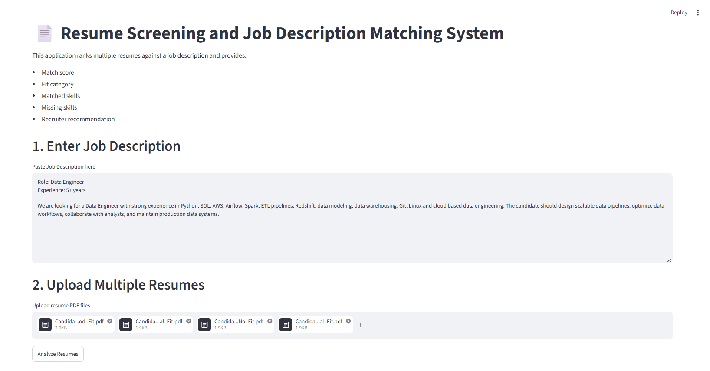
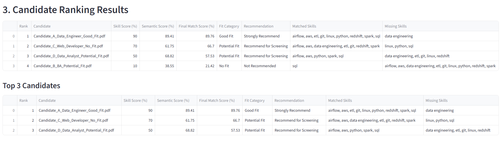
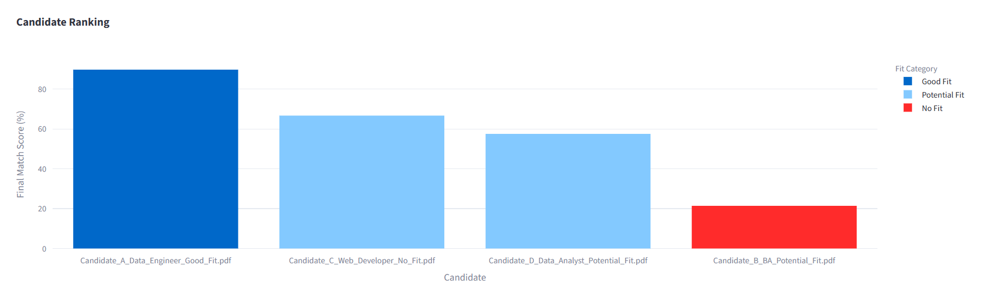
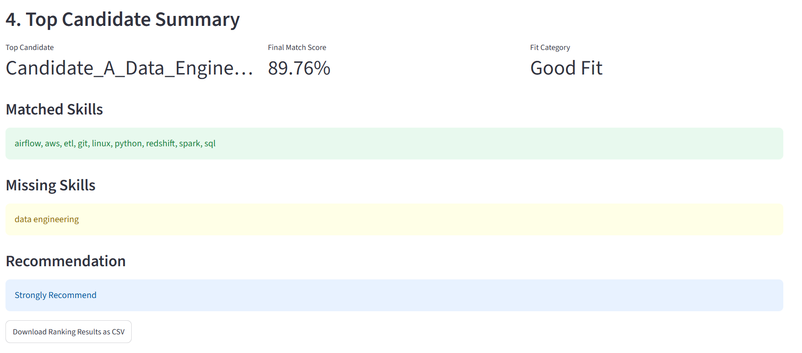
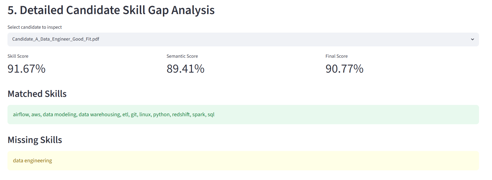

# Resume Screening and Job Description Matching System

## Project Overview

The Resume Screening and Job Description Matching System is an AI-powered recruitment solution designed to automate candidate evaluation and shortlisting. The system analyzes candidate resumes against a given job description using Natural Language Processing (NLP), semantic similarity techniques, skill extraction, and candidate ranking mechanisms.

The objective is to reduce manual screening effort, improve recruiter productivity, and provide explainable recommendations for hiring decisions.

---

## Problem Statement

Recruiters often spend considerable time manually reviewing resumes and comparing them with job requirements. This process is repetitive, subjective, and difficult to scale when dealing with a large number of applications.

This project aims to solve these challenges by:

- Automatically screening resumes against job descriptions.
- Identifying matched and missing skills.
- Measuring semantic similarity between resumes and job descriptions.
- Ranking candidates based on overall suitability.
- Providing recruiter-friendly recommendations and insights.

---

## Dataset Description

### Dataset Source

Resume-JD Matching Dataset from Hugging Face.

### Dataset Statistics

| Dataset | Records |
|----------|----------|
| Training | 6,241 |
| Testing | 1,759 |

### Features

- Job Description
- Resume
- Label

### Target Classes

- Good Fit
- Potential Fit
- No Fit

### Label Distribution

| Label | Count |
|---------|---------|
| No Fit | 3143 |
| Potential Fit | 1556 |
| Good Fit | 1542 |

The dataset is moderately imbalanced, with the majority of samples belonging to the No Fit category.

---

## Solution Architecture

```text
Job Description + Resume
            ↓
     Data Preprocessing
            ↓
      Skill Extraction
            ↓
     SBERT Embeddings
            ↓
 Semantic Similarity Score
            ↓
 Candidate Ranking Engine
            ↓
     Skill Gap Analysis
            ↓
 Recruiter Recommendation
```

---

## Methodology

### 1. Data Preprocessing

The following preprocessing steps were performed:

- Text cleaning
- Missing value validation
- Resume and JD extraction
- Feature engineering

### 2. Exploratory Data Analysis

EDA was performed to understand:

- Label distribution
- Resume length distribution
- Job description length distribution
- Frequently occurring skills
- Class imbalance

### 3. Baseline Model

A baseline classification model was developed using:

- TF-IDF Vectorization
- Logistic Regression

This model provides a benchmark for evaluating advanced approaches.

### 4. Semantic Similarity Analysis

Sentence-BERT (SBERT) was used to generate contextual embeddings for:

- Job Descriptions
- Candidate Resumes

Cosine similarity was calculated to measure semantic relevance.

### 5. Advanced Model

The advanced classification pipeline uses:

- SBERT Embeddings
- XGBoost Classifier

This model captures semantic relationships more effectively than traditional TF-IDF features.

### 6. Skill Extraction

A rule-based skill extraction engine was developed to identify:

- Technical skills
- Cloud skills
- Analytics skills
- Business skills

from both job descriptions and resumes.

### 7. Candidate Ranking

Candidates are ranked using:

Final Match Score =

60% Skill Match Score +
40% Semantic Similarity Score

This hybrid scoring approach combines explainability and semantic understanding.

---

## Models Used

| Model | Purpose |
|---------|---------|
| TF-IDF + Logistic Regression | Baseline Classification |
| Sentence-BERT | Semantic Similarity |
| XGBoost | Advanced Classification |
| Skill Extraction Engine | Explainable Candidate Evaluation |

---

## Model Performance

### Baseline Model

TF-IDF + Logistic Regression

Accuracy: 51.22%

### Advanced Model

SBERT + XGBoost with feature augmentation and hyperparameter tuning. The advanced pipeline now combines semantic embedding features with skill matching features and uses `RandomizedSearchCV` to tune model hyperparameters.

### Training and model artifacts

This repository includes a training script at `src/train.py` that builds SBERT-based features, augments them with handcrafted skill features, tunes XGBoost hyperparameters, and saves artifacts into `models/`:

- `models/xgb_classifier.joblib`
- `models/label_encoder.joblib`

The Streamlit app loads these artifacts automatically when available, enabling both skill-based ranking and classifier-backed predictions.

To retrain the model, run:

```bash
python src/train.py
```

### Submission Guidance
This repository is runnable without the notebook, but notebooks are still recommended as part of the capstone deliverables. A complete submission should include:

- `src/` for the model, preprocessing, and skill extraction logic
- `app/` for the Streamlit dashboard
- `requirements.txt` for dependencies
- `README.md` for usage instructions
- `notebooks/` for data access, EDA, baseline model, and advanced model workflows
- `models/` for trained model artifacts so the deployment app can load them without retraining

Recommended commands:

```bash
python src/train.py
streamlit run app/streamlit_app.py
```

If using Google Colab, upload or mount the full repository directory before executing the notebook.

### Requirement Alignment
This repo aligns with the capstone problem statement by providing:

- reproducible Hugging Face dataset access using `datasets`
- dataset validation, preprocessing, and EDA
- baseline model + advanced SBERT + XGBoost model pipeline
- skill-gap extraction and candidate ranking
- a Streamlit deployment prototype that loads trained artifacts
- Docker packaging support via `Dockerfile`
- evaluation metrics, confusion matrix, and limitations documentation

### Observations

- SBERT outperformed the TF-IDF baseline.
- Semantic embeddings provided better contextual understanding.
- Skill-based ranking improved explainability.
- Candidate recommendations became more recruiter-friendly.

---

## Streamlit Application Features

The project includes a fully functional Streamlit dashboard.

### Features

- Upload multiple PDF resumes
- Enter Job Description
- Skill extraction
- Semantic similarity calculation
- Candidate ranking
- Skill gap analysis
- Recruiter recommendation
- Interactive visualizations
- CSV export

---

## Application Screenshots

### 1. Application Homepage



### 2. Candidate Ranking Results



### 3. Candidate Ranking Visualization



### 4. Top Candidate Summary



### 5. Skill Gap Analysis



---

## Skill Gap Analysis

The system provides detailed candidate-level skill analysis.

For each candidate, the system identifies:

- Matched Skills
- Missing Skills
- Skill Score
- Semantic Score
- Final Match Score

This allows recruiters to understand why a candidate was recommended and what skill gaps exist.

---

## Fairness, Ethics and Responsible AI

This project is designed as a decision-support system and not as an automated hiring solution.

The model does not explicitly use:

- Gender
- Religion
- Ethnicity
- Marital Status
- Caste

Human review is required before making final hiring decisions.

---

## Limitations

Current limitations include:

- Moderate class imbalance.
- Limited predefined skill dictionary.
- Domain-specific skills may be missed.
- Semantic similarity does not guarantee job suitability.
- Candidate experience and certifications are not explicitly weighted.

---

## Future Enhancements

Potential improvements include:

- Fine-tuning transformer models.
- Named Entity Recognition (NER) based skill extraction.
- ATS integration.
- Cloud deployment.
- OCR support for scanned resumes.
- LLM-based candidate evaluation.
- Recruiter analytics dashboard.

---

## Installation Guide

### Clone Repository

```bash
git clone <repository_url>
```

### Navigate to Project

```bash
cd resume_jd_matching
```

### Install Dependencies

```bash
pip install -r requirements.txt
```

### Train Models and Generate Artifacts

```bash
python src/train.py
```

This creates the `models/` folder with saved classifier and encoder artifacts used by the deployed app.

### Run Application

```bash
streamlit run app/streamlit_app.py
```

---

## Project Structure

```text
resume_jd_matching/
│
├── app/
│   └── streamlit_app.py
├── models/  # optional local artifacts created by training
│   ├── xgb_classifier.joblib
│   └── label_encoder.joblib
├── notebooks/
│   └── resume_jd_matching.ipynb
├── screenshots/
│   ├── 01_application_homepage.png
│   ├── 02_candidate_ranking_results.png
│   ├── 03_candidate_ranking_chart.png
│   ├── 04_top_candidate_summary.png
│   └── 05_skill_gap_analysis.png
├── src/
│   ├── preprocessing.py
│   ├── skill_extractor.py
│   ├── matching_engine.py
│   └── train.py
├── requirements.txt
├── README.md
```

---

## Conclusion

The Resume Screening and Job Description Matching System demonstrates how NLP, semantic similarity models, and machine learning can be used to automate candidate evaluation and ranking.

The solution combines:

- Skill extraction
- SBERT semantic matching
- Candidate ranking
- Skill gap analysis
- Recruiter recommendations

to support faster, more informed, and explainable hiring decisions.

This project successfully meets the objectives of automated resume screening and candidate-job matching while providing a practical and deployable recruitment solution.